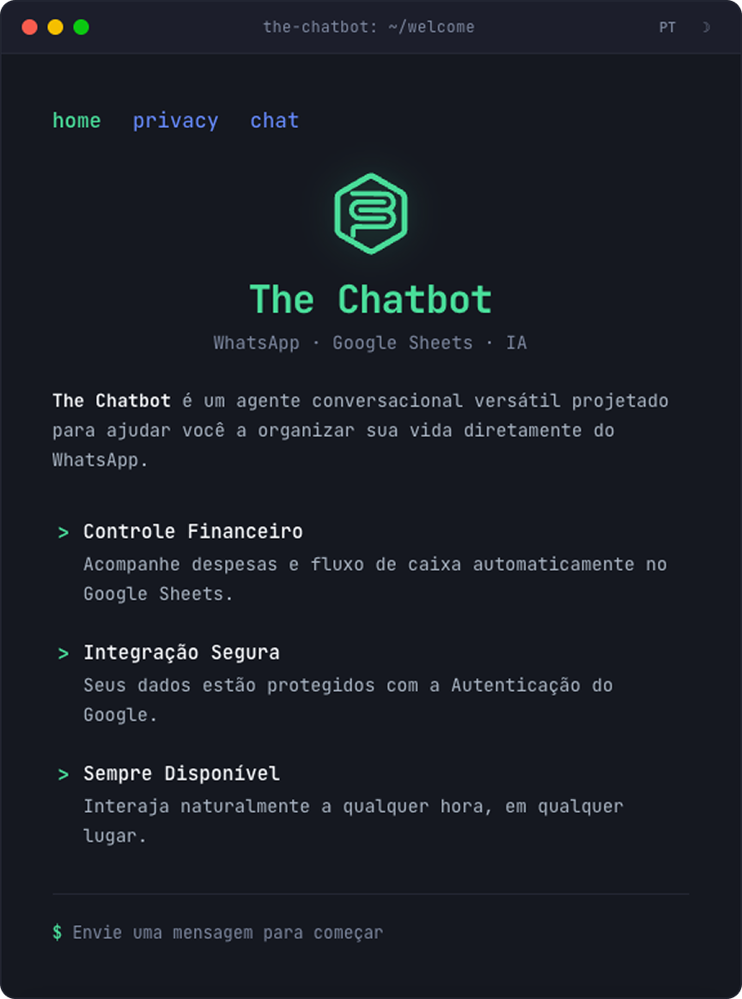
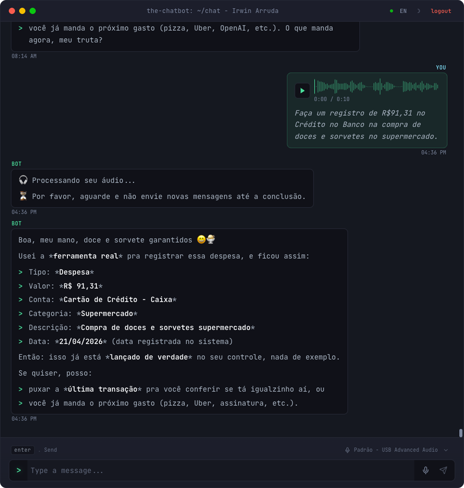

<div align="center">
  
  <h1>The Chatbot</h1>
  <p><em>A personal, terminal-flavored assistant that lives in WhatsApp — and is slowly growing a face on the web.</em></p>
  <p>
    <code>WhatsApp</code> &middot;
    <code>Web Chat</code> &middot;
    <code>Google Sheets</code> &middot;
    <code>LLMs</code>
  </p>
</div>

---

```
the-chatbot: ~/welcome
> A versatile conversational agent designed to help me organize
> my life directly from WhatsApp — and from anywhere a browser opens.
```

<p align="center">
  
</p>

## Why this exists

This is a **personal-use** assistant, not a SaaS. It started as the smallest possible bridge between me and a Google Sheet — "send a WhatsApp message, log an expense" — and has been quietly turning into a long-running platform for the small automations I want in my real life:

- track expenses and earnings without opening a spreadsheet
- transcribe voice notes I send to myself on WhatsApp
- soon: see balances across all my bank accounts at a glance
- soon: a personal note-taker whose real purpose is to feed structured context back to an LLM

The bot is the entry point. The platform behind it is what I actually care about.

## A short history: from C# to TypeScript

The first version of this project was written in **C# / .NET 9**. It was clean, fast, and well-tested — and there is nothing wrong with it. The reason for the rewrite is purely about where the project is going:

- **Frontends are now part of the product.** A welcome page, a privacy page, a web chat, and eventually richer dashboards (bank balances, notes). Living in a single TypeScript codebase with React + TanStack Start removes an entire context switch.
- **One language, end to end.** Server, client, scripts (CLI, migrations) and shared domain entities now share types. The `User`, `Chat`, and `Message` you see in a route loader are literally the same class the service uses.
- **Faster iteration on AI tooling.** The JS/TS ecosystem around LLMs (OpenAI SDK, Anthropic SDK, MCP-style tool calling) moves fast and is where most experimentation happens.
- **Edge-friendly deploys.** TanStack Start + Nitro runs comfortably in environments where .NET would be heavy or awkward.

The architecture, the layering, the "no repositories, raw SQL inside services" philosophy — all of that survived the rewrite intentionally. The language changed; the discipline did not.

## The stack, and why each piece is here

| Layer            | Choice                             | Why                                                                                                                                                  |
| ---------------- | ---------------------------------- | ---------------------------------------------------------------------------------------------------------------------------------------------------- |
| Runtime          | **Bun**                            | Fast install, fast scripts, native TypeScript. Used as the package manager and script runner; production still runs on Node-compatible Nitro output. |
| Server framework | **TanStack Start** (+ Nitro)       | File-based API routes, server functions, and a real React app share the same router. No separate Express/Next split.                                 |
| Client           | **React 19** + **TanStack Router** | Type-safe routing all the way into loaders and search params. Pairs naturally with Start.                                                            |
| Language         | **TypeScript** (strict-ish)        | Shared types between `src/server`, `src/client`, and `src/shared` — domain entities are literal classes used on both sides.                          |
| Database         | **PostgreSQL** + `postgres` driver | Tagged-template SQL inside services. No ORM, no repository layer — see Architecture below.                                                           |
| Migrations       | **node-pg-migrate**                | Plain JS migrations under `infra/migrations/`. Versioned, reversible, simple.                                                                        |
| LLM              | **OpenAI** + **Anthropic** SDKs    | Behind a single `IAiChatGateway` so the model can be swapped per environment.                                                                        |
| Speech           | **OpenAI Whisper** (via SDK)       | Voice notes sent on WhatsApp are downloaded, persisted, and transcribed before being fed to the LLM.                                                 |
| Storage          | **Cloudflare R2** (S3 SDK)         | Permanent storage for audio media (WhatsApp media URLs expire).                                                                                      |
| Messaging        | **WhatsApp Business Cloud API**    | The original — and still primary — interface.                                                                                                        |
| Tooling          | **Biome**, **Vitest**, **Docker**  | Lint + format in one tool, fast tests, local Postgres via Compose.                                                                                   |
| Styling          | **Tailwind v4** + **shadcn/ui**    | Utility-first, with a small set of accessible primitives. Drives the terminal-window look without bespoke CSS.                                       |

## Architecture

Same layering as v1, just expressed in TypeScript:

```
Route (TanStack)  ─►  Service  ─►  Entity (shared)
                      │   ▲
                      ▼   │
                    Gateway (resource interface + impl)
                      │
                      ▼
                External API / DB / LLM / Storage
```

### Why this layering is good (for this project)

- **Entities are not anemic.** A `Chat` knows how to add a user message, a button reply, or an audio message. A `User` creates and updates its own `Credential`. Logic lives where the data lives — DDD-light.
- **No repositories, no mappers.** SQL is written as `private` methods inside the service that owns it, using tagged templates (`this.database.sql\`SELECT ...\``). Reading the service tells you the whole story — domain rules and the exact query that backs them — in one file.
- **Gateways isolate the outside world.** Every external dependency (WhatsApp, Google Auth, Google Sheets, OpenAI, Anthropic, R2, Whisper, the web SSE bus) is behind an `I*Gateway` interface with at least a real and a `Test*` implementation. Swapping providers is a one-line change in [`infra/bootstrap.ts`](./infra/bootstrap.ts).
- **A tiny DI container wires everything.** [`infra/container.ts`](./infra/container.ts) + [`infra/bootstrap.ts`](./infra/bootstrap.ts) keeps construction in one place. Tests rebuild the container with fakes via [`tests/orquestrator.ts`](./tests/orquestrator.ts), which also wipes the schema between files.
- **A mediator decouples cross-service effects.** Sending a "signed in" WhatsApp message after Google login, or deleting a chat when a user is removed, happens through `Mediator` events — services don't need to know about each other directly.
- **Two front-doors, one core.** WhatsApp messages and the web chat share the exact same `MessagingService` pipeline; the only thing that changes is which `IMessagingGateway` writes the reply.

<p align="center">
  
  <br/>
  <sub><em>Web chat: voice notes are uploaded, transcribed by Whisper, then handed to the LLM — which calls real services (here, logging an expense to Google Sheets) and reports back.</em></sub>
</p>

### Where things live

```
infra/
  bootstrap.ts        # DI wiring (the one place that knows what implements what)
  container.ts        # Tiny dependency container
  database.ts         # postgres.js client wrapper
  Mediator.ts         # In-process event bus
  config.ts           # Runtime config built from process.env
  migrations/         # node-pg-migrate, plain JS
src/
  server/
    services/         # 5 services described above (this is where logic lives)
    resources/        # Gateway interfaces + real / test implementations
    tanstack/         # Server-side TanStack helpers
    utils/            # Mediator wiring helpers, MessageLoader, WhatsAppTextChunker, ...
  shared/
    entities/         # User, Chat, Message, Credential, CashFlowSpreadsheet, ...
  client/
    routes/           # File-based TanStack routes (welcome, privacy, chat)
    components/       # UI (terminal-themed shadcn/ui)
    i18n/             # PT/EN strings
tests/                # Vitest, runs serially, wipes schema per file
```

## Running it

> Personal-use project. The setup is documented but assumes you know your way around Postgres, ngrok, and Google Cloud OAuth credentials.

### Prerequisites

- **Bun** ≥ 1.3
- **Docker** + Docker Compose (for local Postgres)
- **ngrok** (for receiving WhatsApp webhooks locally)
- A Google Cloud project with OAuth client + Sheets API enabled
- WhatsApp Business Cloud API credentials
- An OpenAI key (Anthropic optional, depending on `AI_MODEL`)
- A Cloudflare R2 bucket (or any S3-compatible storage)

### First run

```bash
bun install
bun run services:up        # starts Postgres in Docker
bun run migrate:up         # applies migrations
cp .env .env.development   # then fill in real values for your providers
bun run dev                # mode=development, http://localhost:3000
```

To expose the local server to WhatsApp:

```bash
bun run dev:local          # starts vite + ngrok in parallel
```

### Common scripts

| Command                  | What it does                                                     |
| ------------------------ | ---------------------------------------------------------------- |
| `bun run dev`            | Dev server in `mode=development` on port 3000                    |
| `bun run dev:local`      | Same as above + ngrok tunnel for WhatsApp webhooks               |
| `bun run test`           | Spin up Postgres, migrate, run Vitest serially against a real DB |
| `bun run typecheck`      | `tsc --noEmit`                                                   |
| `bun run check`          | Biome lint + format check                                        |
| `bun run check:fix`      | Auto-fix lint and formatting                                     |
| `bun run migrate:create` | `bun run migrate:create -- <name>` — scaffold a new migration    |
| `bun run migrate:up`     | Apply pending migrations                                         |
| `bun run migrate:down`   | Roll back one migration                                          |

### Environments

`--mode` is the single source of truth. Valid values: `development`, `test`, `preview`, `production`.
`.env` is always loaded first (template with placeholders), then `.env.${mode}` overrides it. Vite and Vitest have `envDir: false`, so only the explicitly selected mode file is loaded by the project config.

## Testing philosophy

- Vitest runs **serially** with a 30s timeout. Each test file gets a clean schema (`DROP SCHEMA public CASCADE` → recreate → migrate) via [`tests/orquestrator.ts`](./tests/orquestrator.ts), so tests are isolated without mocks-of-mocks.
- Only **application** tests live in the default suite: services, entities, utils. Routes, controllers, gateways and infra are deliberately excluded — they are exercised end-to-end through service tests.
- Gateways have `Test*` implementations registered by the test orchestrator, so business logic is covered without hitting OpenAI, Google, or WhatsApp during CI.

---

## Roadmap

### Done (v1 → v2 parity and beyond)

- [x] Port from C# / .NET to TypeScript (TanStack Start + React 19)
- [x] Controller → Service → Entity layering preserved
- [x] Raw SQL inside services, no ORM, no repositories
- [x] Postgres migrations via `node-pg-migrate`
- [x] DI container + bootstrap + mediator
- [x] Google OAuth (app flow with encrypted state, web flow with JWT)
- [x] WhatsApp Business Cloud API integration (text, buttons, audio)
- [x] Cash flow: add expense / add earning / list / delete last
- [x] Audio messages: download → R2 → Whisper transcript → fed to LLM
- [x] Conversation summarization to keep LLM prompts bounded
- [x] `allowed_numbers` gating
- [x] Web chat gateway (SSE) + welcome / privacy pages with terminal aesthetic
- [x] PT / EN translations on the web side
- [x] Vitest suite with full schema reset between test files

### Next

- [ ] Add bank balance list for the user
- [ ] Add a note taker feature that integrates flawlessly with the chat but has a web interface
- [ ] Add audio files/transcriptions to the note taker feature
- [ ] Add a reminder feature that notifies the user for something
- [ ] Use the database as source-of-truth for spreadsheet data (cache layer)
- [ ] Structured logging service (replace ad-hoc `console`)
- [ ] Log + alert on disallowed phone numbers attempting to use the bot

---

<sub>Built for one user. Reviewed by the same user. Maintained, hopefully, by him too.</sub>
