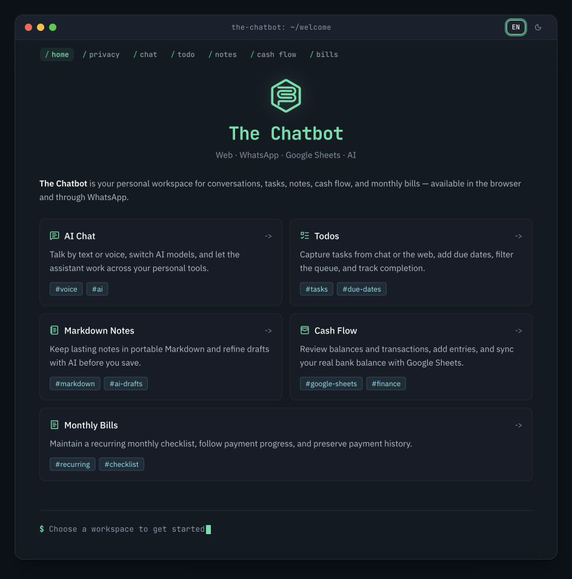
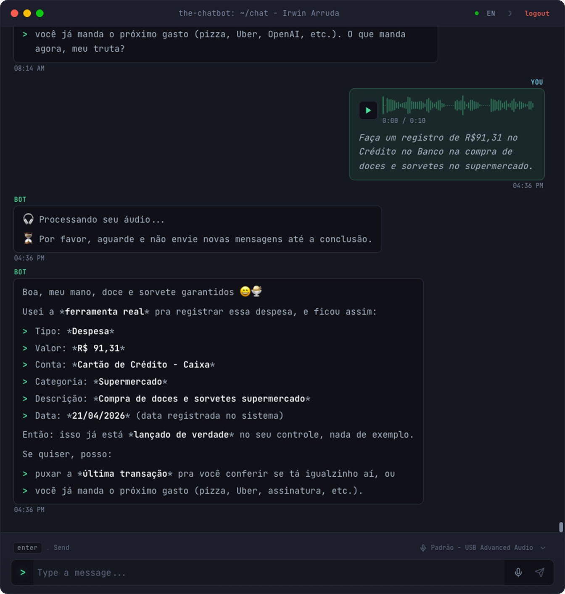

<div align="center">
  
  <h1>The Chatbot</h1>
  <p><em>A personal AI workspace across WhatsApp and the web.</em></p>
  <p>
    <code>AI Chat</code> &middot;
    <code>Todos</code> &middot;
    <code>Markdown Notes</code> &middot;
    <code>Cash Flow</code> &middot;
    <code>Monthly Bills</code>
  </p>
</div>

---

```text
the-chatbot: ~/welcome
$ One assistant for conversations, tasks, notes, and personal finances.
```

<p align="center">
  
</p>

## What it is

The Chatbot is a **personal-use assistant**, not a SaaS. It started as a small bridge between WhatsApp and a Google Sheet: send a message, log an expense. It has grown into a compact personal operating surface with two front doors and one application core.

| Workspace | What it does |
| --- | --- |
| **AI Chat** | Text and voice conversations, live activity over SSE, runtime model selection, reasoning-effort controls, and tools that act on the other workspaces. |
| **Todos** | Capture tasks from chat or the web, assign due dates, filter the queue, and track completion. |
| **Markdown Notes** | Create durable, portable notes; edit and preview Markdown; refine a draft with AI before explicitly saving it. |
| **Cash Flow** | Review balances and transactions, add entries, transfer between accounts, and synchronize real bank balances with Google Sheets. |
| **Monthly Bills** | Maintain a recurring checklist, follow monthly progress by count and value, mark payments from chat or the web, and preserve history. |

Google sign-in protects the private web workspaces and returns the user to the exact page they originally requested. The interface is responsive, terminal-flavored, and available in Portuguese and English.

## Why it exists

The bot is the entry point; the reusable personal platform behind it is the point. The project favors small automations that remove friction from real life:

- send a WhatsApp message instead of opening a finance spreadsheet
- turn voice into a useful conversation or task
- keep personal notes in a format that remains portable
- see tasks, balances, transactions, and bills without asking the model to reconstruct state
- let the assistant use those same capabilities through explicit application tools

The first version was written in **C# / .NET 9** ([irwinarruda/the-chatbot](https://github.com/irwinarruda/the-chatbot)). The TypeScript rewrite keeps the same practical discipline while putting the server, web app, scripts, and shared contracts in one codebase.

## Architecture

The application is a **feature-oriented modular monolith**. Each capability owns its entities, Services, gateway contracts, DTOs, and client code. Shared HTTP and client infrastructure coordinate modules without taking ownership of their business rules.

```text
WhatsApp webhook        TanStack web app
        │                      │
        └──────────┬───────────┘
                   ▼
          shared HTTP controllers
                   ▼
             module Services
            ┌──────┼──────┐
            ▼      ▼      ▼
         entities  SQL   gateway contracts
                    │      │
                    ▼      ▼
               PostgreSQL  Google / Meta / Pi / OpenAI / R2
```

- **Services own workflows and persistence.** SQL stays close to the behavior that uses it. There is no ORM or repository layer.
- **Entities own invariants and transitions.** Application code does not pass loosely shaped records around when the domain owns a stronger type.
- **Gateways isolate external systems.** Real providers and deterministic test implementations share the same module-owned contracts.
- **Zod DTOs protect boundaries.** HTTP, SSE, provider, and client mappings are parsed before they enter application behavior.
- **Composition is explicit.** [`infra/bootstrap.ts`](./infra/bootstrap.ts) constructs the typed application graph and supports targeted dependency overrides in tests.
- **Both interfaces share the same core.** WhatsApp and web chat enter the same messaging workflow; only their delivery gateways differ.

### Repository shape

```text
infra/
  bootstrap.ts          # Typed application composition root
  database.ts           # postgres.js connection boundary
  migrations/           # node-pg-migrate migrations
  scripts/              # Local, credential, migration, and release utilities

src/
  modules/
    chat/                # Conversations, AI tools, model selection, messaging
    identity/            # Users, Google auth, credentials, access control
    cash-flow/           # Transactions, balances, Sheets integration, bills
    todos/               # Todo domain, Service, HTTP contracts, and UI
    notes/               # Markdown notes, AI refinement, and UI
    system/              # Status and migration capabilities
  shared/
    client/              # Routes, terminal UI, preferences, and i18n
    http/                # Controllers, middleware, and web server composition
    config/              # Runtime configuration schemas

tests/
  entities/ services/ dtos/ client/ integration/ http/ architecture/ ui/
```

<p align="center">
  
  <br />
  <sub><em>Web chat and WhatsApp can reach the same application tools and persisted conversation state.</em></sub>
</p>

## Stack

| Area | Choice | Role |
| --- | --- | --- |
| Runtime and package manager | **Bun** | Installs dependencies and runs the TypeScript scripts. |
| Full-stack web | **TanStack Start**, **React 19**, **TanStack Router**, **Vite** | Type-safe routes, server handlers, SSR, and the browser UI. |
| Database | **PostgreSQL**, `postgres`, **node-pg-migrate** | Conversation and workspace state, raw tagged-template SQL, reversible migrations. |
| AI runtime | **Pi AI** + **Pi Agent Core** | Provider/model normalization, reasoning configuration, streaming, and the tool loop. |
| Speech and storage | **OpenAI speech-to-text**, **Cloudflare R2** | Audio transcription and durable media storage. |
| Integrations | **WhatsApp Business Cloud API**, **Google OAuth**, **Google Sheets** | Messaging, authentication, and finance data. |
| Interface | **Tailwind CSS v4**, **shadcn/ui** | Responsive terminal visual system and accessible primitives. |
| Quality | **TypeScript**, **Biome**, **Vitest** | Static checking, formatting/linting, and layered tests. |

## Running locally

> This is a personal project. Local setup assumes access to its provider credentials and some familiarity with PostgreSQL, Google Cloud, and Meta webhooks.

### Prerequisites

- Bun 1.3 or newer
- Docker with Docker Compose for local PostgreSQL
- ngrok when receiving WhatsApp webhooks locally
- Google OAuth and Sheets credentials
- WhatsApp Business Cloud API credentials
- credentials for at least one supported Pi model provider
- an S3-compatible bucket for durable audio storage

### First run

```bash
bun install
cp .env .env.development # replace placeholders with development credentials
bun run services:ready
bun run dev              # http://localhost:3000
```

To start Vite and the local WhatsApp tunnel together:

```bash
bun run dev:local
```

### Environment modes

The environment loader always reads `.env` first and then overlays `.env.<mode>`. Supported modes are `development`, `test`, `preview`, and `production`; `bun run dev` defaults to `development`, and Vitest defaults to `test`.

Keep real credentials in the ignored mode-specific files. Never add production secrets to `.env` or the repository.

## Common commands

| Command | What it does |
| --- | --- |
| `bun run dev` | Start the development server on port 3000. |
| `bun run dev:local` | Start the app, local PostgreSQL, seeded access, and ngrok. |
| `bun run build` | Build the production application. |
| `bun run test` | Prepare test PostgreSQL and run the serial Node test suite. |
| `bun run test:ui` | Run the separate jsdom React UI suite. |
| `bun run typecheck` | Run TypeScript without emitting files. |
| `bun run check` | Run Biome formatting and lint checks. |

Migration, credential, provider smoke-test, and production delivery commands remain available in [`package.json`](./package.json) and the project agent instructions; they are intentionally kept out of the everyday setup path.

## AI models and credentials

The chat is not tied to one hard-coded model. The configured default can be changed at runtime from the web controls or the `/model` and `/effort` commands. Pi normalizes the supported provider/model paths while the application keeps conversation state and generation traces in PostgreSQL.

Per-user provider credentials are encrypted before persistence. OpenAI Codex authentication has a dedicated local login script; other supported credentials can be imported explicitly. The Pi packages are pinned to the same exact version and should always be upgraded together.

Provider credential setup, smoke tests, and Pi upgrade validation are maintainer operations documented by the repository scripts rather than part of the everyday setup path.

## Testing

- The main Vitest suite runs serially with a 30-second timeout and prepares a real PostgreSQL test database through the project scripts.
- Entity, DTO, and provider-independent Service tests stay deterministic and infrastructure-free where possible.
- PostgreSQL integration tests own database, migration, transaction, hydration, and concurrency behavior.
- UI tests run separately under jsdom through `bun run test:ui`.
- Architecture tests protect module ownership and dependency direction.
- Test gateways keep Google, Meta, storage, speech, and AI calls out of ordinary CI runs.

## Current status

### Available now

- [x] Text and voice chat on WhatsApp and the web
- [x] Runtime AI provider/model selection and reasoning effort
- [x] Persisted conversation history, summaries, and generation traces
- [x] Cash-flow entries, transfers, transaction history, and bank balances
- [x] Recurring monthly bills with progress and payment history
- [x] Todos with due dates, filters, chat tools, and source transcripts
- [x] Portable Markdown notes with explicit AI-assisted refinement
- [x] Google-authenticated private web workspaces
- [x] Responsive Portuguese and English terminal UI

### Next

- [ ] Attach audio files and transcriptions to notes
- [ ] Add reminders and proactive notifications
- [ ] Move spreadsheet-backed finance data toward a database source of truth
- [ ] Replace remaining ad-hoc logs with structured logging and security alerts

---

<sub>Built for one user. Reviewed by the same user. Maintained, hopefully, by him too.</sub>
